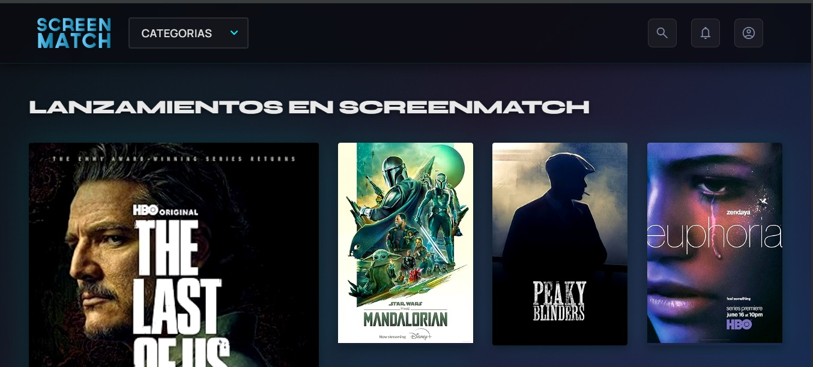
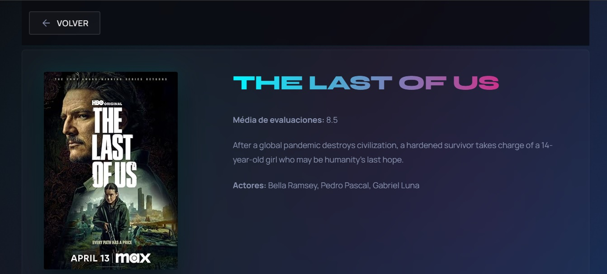
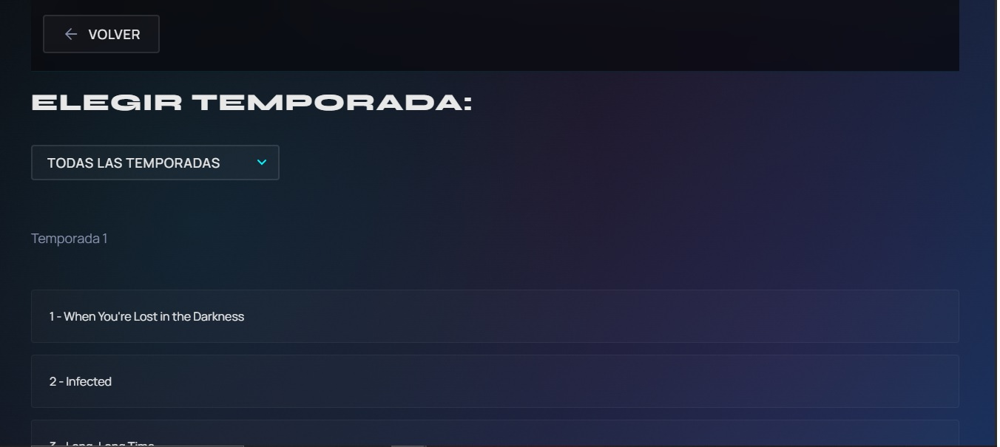

<h1 align="center">ScreenMatch</h1>

<p align="center">
   
</p>

Proyecto desarrollado durante la Formación Java y Spring Framework del programa Oracle Next Education G9.

## 📝 Descripción
ScreenMatch es una aplicación diseñada para facilitar la administración y consulta de información relacionada con películas y series. Este proyecto busca resolver el problema del manejo desorganizado de datos sobre contenido audiovisual, permitiendo gestionar y acceder fácilmente a los detalles de cada material.

### ✨ Características
La aplicación ScreenMatch contara con las siguientes funcionalidades:
- Mostrar series y peliculas por categorias:
   -  Comedia.
   -  Acción
   -  Crimen.
   -  Drama.
   -  Aventuara.
- Mostrar detalles de una serie o pelicula:
   - Media de evaluación.
   - Descripción breve.
   - Actores.
   - Selección de temporada.
   - Top 5 capitulos.  

---
## 🖥 Preview
<table align="center">
  <tr>
    <td align="center"><br><sub><b>Página principal</b></sub></td>
  </tr>
  <tr>
    <td align="center"><br><sub><b>Detalles de Serie o Pelicula</b></sub></td>
  </tr>
   <tr>
     <td align="center"><br><sub><b>Temporadas</b></sub></td>
  </tr>
</table>

---
## 🛠️ Stack Tecnológico
<div align="center">
  
  | Tecnología  |                 Descrpción               |                              Icon                               |
  | :---------: | :--------------------------------------: | :-------------------------------------------------------------: |
  |    Java     |         Lenguaje de programación         |       |
  |     Git     |      Sistema de control de versiones     |        |
  |    Maven    |    gestión y construcción de proyecto    |      |
  | Spring Boot |                 Framework                |     |
  |  PostgreSQL | sistema almacenar y gestionar datos (DB) |   |
   
</div>

---
## 📂 Estructura del Proyecto

```
SCREENMATCH/
├── .mvn/                          # Configuración del Maven Wrapper
└── src/
    └── main/
        ├── java/com/david/screenmatch/
        │   ├── config/            # Configuraciones globales (CORS)
        │   ├── controller/        # Controladores REST (endpoints de la API)
        │   ├── dto/               # Objetos de Transferencia de Datos (Data Transfer Objects)
        │   ├── model/             # Entidades del dominio y modelos de datos
        │   ├── principal/         # Clase con la lógica de interacción por consola
        │   ├── repository/        # Repositorios JPA para acceso a base de datos
        │   ├── service/           # Clase de lógica de negocio
        |   ├── ScreenmatchApplicationConsola.java # Clase de lógica de negocio
        │   └── ForoHubApplication.java  # Punto de entrada para modo consola
        └── resources/
            └── application.properties  # Configuración de la aplicación
```

### 📦 Descripcion de Paquetes
<div align="center">

  |       Paquete      |                                                           Descripción                                                             |
  |--------------------|-----------------------------------------------------------------------------------------------------------------------------------|
  |    `config`        | Contiene las clases de configuración del framework. En este caso, incluye CorsConfiguration.java para gestionar los permisos de acceso desde el frontend.  |
  |   `controller`     | Capa encargada de manejar las solicitudes HTTP. Define los endpoints de la API y coordina la respuesta que se envía al cliente (ej. SerieController.java). |
  | `dto` | Contiene clases ligeras (usualmente Records) destinadas a transportar datos entre el servidor y el cliente, evitando exponer directamente las entidades de la base de datos. |
  |  `model` | Define las entidades de negocio (como Serie y Episodio) y los modelos de datos utilizados por Jackson para el mapeo de la API externa (como DatosSerie y DatosEpisodio). |
  |     `principal`    | Contiene la clase Principal.java, que centraliza la lógica de ejecución del menú interactivo si la aplicación se corre en modo terminal. |
  |    `repository`    | Define las interfaces que extienden de JpaRepository. Es la capa que se comunica directamente con la base de datos para realizar operaciones CRUD y consultas personalizadas.|
  |      `service`     |          Contiene la lógica de negocio compleja, procesando la información antes de ser entregada al controlador o guardada en el repositorio.           |
  
</div>

---
## ✅ Prerrequisitos
Antes de comenzar, asegúrate de tener instalado lo siguiente en tu entorno local:
1. **Java JDK 17 o superior** — Necesario para ejecutar la aplicación Spring Boot.
   - Verificar versión: `java -version`

2. **Maven** *(Opcional)* — Aunque el proyecto incluye el Maven Wrapper (`mvnw`),
   es recomendable tenerlo instalado globalmente.
   - Verificar versión: `mvn -version`

3. **PostgreSQL** — Base de datos relacional necesaria para persistir los datos.
   - Verificar versión: `psql --version`

4. **IDE o Editor de Texto** — Se recomienda:
   - [IntelliJ IDEA](https://www.jetbrains.com/idea/)
   - [Visual Studio Code](https://code.visualstudio.com/) con el *Extension Pack for Java*

5. **Git** — Para clonar el repositorio.
   - Verificar versión: `git --version`

### ⚙️ Configuración de Variables de Entorno
Antes de ejecutar el proyecto, define las siguientes variables de entorno.
Si no se definen, se usarán los valores por defecto indicados.

<div align="center">

  |    Variable   |                Descripción               |               Valor por defecto           |
  |---------------|------------------------------------------|-------------------------------------------|
  |    `DB_URL`   |    URL de conexión a la base de datos    | `jdbc:postgresql://${DB_HOST}/${DB_NAME}` |
  |   `DB_NAME`   |       Nombre de la base de datos         |                      —                    |
  | `DB_USERNAME` |         Usuario de PostgreSQL            |                      —                    |
  | `DB_PASSWORD` |        Contraseña de PostgreSQL          |                      —                    |

</div>

> ⚠️ **Importante:** Debes crear la base de datos antes de ejecutar el programa. Se recomienda definir siempre `DB_NAME` `DB_USERNAME`, `DB_PASSWORD` como variables de entorno, nunca dejar los valores por defecto expuestos.

---
##  Ejecución del Proyecto

### 1. Clonar el repositorio
Clonar el repositorio:
```bash
git clone https://github.com/Daavid-Anaya/screen-match.git
cd screen-match
```

### 2. Crear la base de datos en PostgreSQL
```sql
CREATE DATABASE nombre_base_de_datos;
```
   
### 3. Configurar las variables de entorno
Define las variables en tu sistema operativo o en tu IDE antes de ejecutar:

**Linux / macOS:**
```bash
export DB_URL=jdbc:postgresql://${DB_HOST}/${DB_NAME}
export DB_NAME=nombre_base_de_datos
export DB_USERNAME=tu_usuario
export DB_PASSWORD=tu_contraseña
```

**Windows (CMD):**
```cmd
set DB_URL=jdbc:postgresql://${DB_HOST}/${DB_NAME}
set DB_NAME=nombre_base_de_datos
set DB_USERNAME=tu_usuario
set DB_PASSWORD=tu_contraseña
```

**Windows (PowerShell):**
```powershell
$env:DB_URL="jdbc:postgresql://${DB_HOST}/${DB_NAME}"
$env:DB_NAME="nombre_base_de_datos"
$env:DB_USERNAME="tu_usuario"
$env:DB_PASSWORD="tu_contraseña"
```

### 4. Descarga el Frontend de ScreenMatch
Dirijase al repositorio de [ScreenMatch Frontend](https://github.com/Daavid-Anaya/screenmatch-frontend) y sigue los pasos de instalación.

### 5. Ejecutar el proyecto

**Con Maven Wrapper (recomendado):**
```bash
# Linux / macOS
./mvnw spring-boot:run

# Windows
mvnw.cmd spring-boot:run
```

**Con Maven instalado globalmente:**
```bash
mvn spring-boot:run
```

### 6. Verificar que la aplicación está corriendo

Una vez iniciada, la API estará disponible en:
```
http://localhost:8080
```
